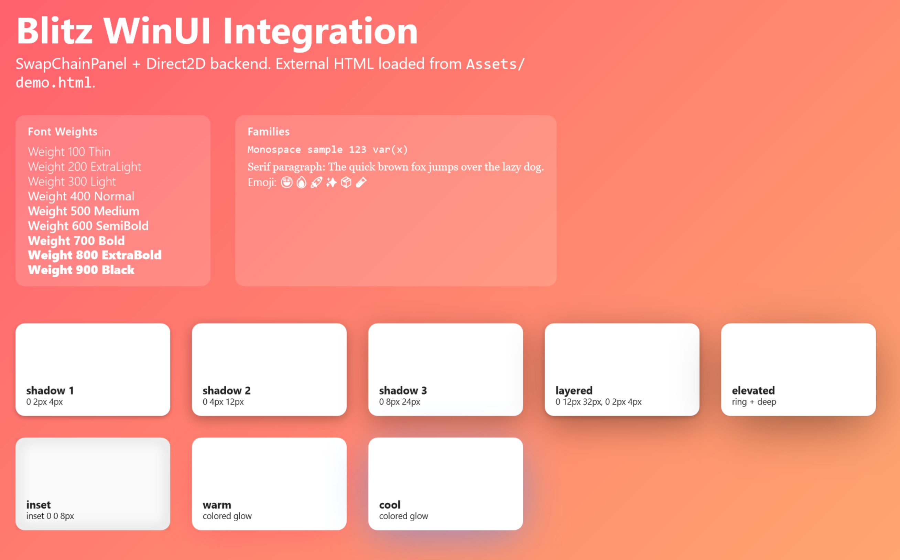

# blitz-shell-winui

WinUI / WinAppSDK host shell for Blitz consumable from C#. Renders into a `Microsoft.UI.Xaml.Controls.SwapChainPanel` using a DXGI swapchain and a Direct2D backend (no HWND dependency).

## Design

- Expose a WinRT component (`Blitz.WinUI.Host`) with methods: `SetPanel`, `CreateInstance`, `Resize`, `RenderOnce`, `LoadHtml`, and input forwarding.
- Create / manage a DXGI swapchain targeted at the provided `SwapChainPanel`; acquire backbuffer for Direct2D drawing.
- Use the `anyrender_d2d` backend to replay recorded Blitz scene commands (paths, gradients, images, text) straight into the swapchain.
- Translate host pointer / keyboard events to Blitz DOM events.

## Screenshots

## Implementation Status (Aug 2025)

- WinRT IDL -> midlrt -> winmd -> Rust bindings pipeline (generated `bindings.rs`, never hand edit).
- Activation factory + runtime class implemented in Rust.
- Direct2D backend integration (paths, layers, transforms, solid / gradient / image brushes, glyph runs, real Gaussian blur box shadows (outset & inset)).
- Shadow rendering uses temporary D2D device contexts (no mid-frame target mutation) for stability.
- Build script gracefully skips WinMD regeneration if `midlrt` missing (recommend VS DevShell task).
- Verbose logging opt-in via `BLITZ_VERBOSE=1` environment variable (clean default output).

## Roadmap (Next Steps)

- Blend / composite mode mapping.
- Gradient extend modes & improved sweep (angular) gradient.
- Proper text shaping (embedded font collection, fallback, weight/style selection).
- Device lost handling & renderer resource reinit.
- Cache eviction policies (shadows, gradients, images) & metrics.
- Sample WinUI3 app polish & usage docs.
- Telemetry / diagnostics surface (frame timings, cache stats) gated behind feature/env.
- Optional removal / gating of unused rendering backends for slimmer shell distribution.
- API for setting verbose logging from C# instead of env-only.
- Future: effect graph / filter APIs once backend abstraction lands.

See `docs/PROGRESS.md` and `../anyrender_d2d/README.md` for full details and current gaps.

## Contributing Notes

- Always run cargo checks from a VS 2022 DevShell PowerShell so `midlrt` & SDK tools are on PATH (use provided VS Code task).
- Never edit `src/bindings.rs` by hand.
- Avoid introducing any HWND-based interfaces; interact only via the `SwapChainPanel` WinRT object.
- Do not commit generated `*.winmd`, `*.dll`, `*.pdb` artifacts (now gitignored).
- Keep Direct2D-specific types encapsulated; shell boundary remains WinRT + neutral abstractions.

## Known Limitations (Aug 2025)

- No device lost recovery logic wired (backend lacks reinit path exposure).
- Text shaping limited (basic glyph runs, no fallback/shaping features).
- Blend/composite & gradient extend modes not yet surfaced.
- Cache eviction & metrics not exposed; caches may grow unbounded in long sessions.
- Verbose logging control only via environment variable (no runtime API yet).

## Future Integration Points

- Provide C# API to toggle verbose logging & query stats.
- Expose shadow spread parameters once backend implements them.
- Add optional in-app debug overlay (frame time, command counts, cache sizes).
